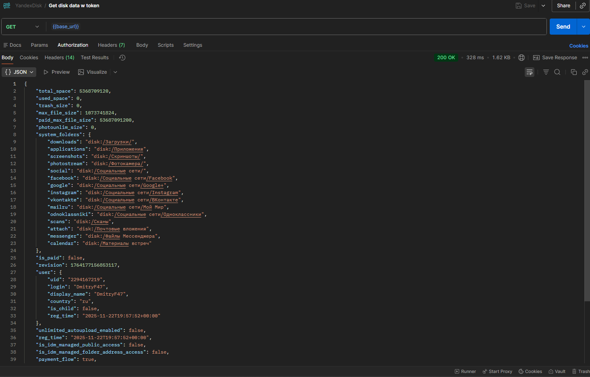

# GET запрос с авторизацией:

================================

# GET запрос без авторизации:

### Тестовый набор Яндекс Диск Тестирование API

## Цель: Тестирование операций c пользовательскими данными через REST API Яндекс диска

## Предусловия:

- Авторизация с токеном (OAuth)

## Тест-кейсы:

### 1. Операции с папками:

++++++++++++++++++++++++++++++++++++++++++++++++

## 1.1 Создать папку через API

**Шаги:**

1. Отправить PUT запрос https://cloud-api.yandex.net/v1/disk/resources?path=/{Путь к тестовой папке}
2. Проверить код ответа.
3. Проверить json в теле ответа.

**Ожидаемый результат:**

- Код ответа на PUT запрос: 201 Created
- В теле ответа есть "method", "href", "templated"

**Постусловие:** удалить созданную папку

++++++++++++++++++++++++++++++++++++++++++++++++

## 1.2 Создать папку через API без авторизации

**Предусловие:** Шаги воспроизводить от лица пользователя без авторизации

**Шаги:**

1. Отправить PUT запрос https://cloud-api.yandex.net/v1/disk/resources?path=/{Путь к тестовой папке}
2. Проверить код ответа.
3. Проверить json в теле ответа.

**Ожидаемый результат:**

- Код ответа на PUT запрос:401 UNAUTHORIZED
- В теле ответа есть "error", "description", "message"

++++++++++++++++++++++++++++++++++++++++++++++++

## 1.3 Создать папку с уже существующим путем через API

**Предусловие:** Создана папка с путем: /{Путь к тестовой папке}

**Шаги:**

1. Отправить PUT запрос https://cloud-api.yandex.net/v1/disk/resources?path=/{Путь к тестовой папке}
2. Проверить код ответа.
3. Проверить json в теле ответа.

**Ожидаемый результат:**

- Код ответа на PUT запрос: 409 CONFLICT
- В теле ответа есть "error", "description", "message"

**Постусловие:** удалить созданную папку

++++++++++++++++++++++++++++++++++++++++++++++++

## 1.4 Удалить папку через API

**Предусловие:** Создана папка с путем: /{Путь к тестовой папке}

**Шаги:**

1. Отправить DELETE запрос https://cloud-api.yandex.net/v1/disk/resources?path=/{Путь к тестовой папке}
2. Проверить код ответа.

**Ожидаемый результат:**

- Код ответа на DELETE запрос: 204 NO CONTENT

++++++++++++++++++++++++++++++++++++++++++++++++

## 1.5 Удалить папку через API без авторизации

**Предусловие:** Создана папка с путем: /{Путь к тестовой папке}, шаги воспроизводить от лица пользователя без авторизации

**Шаги:**

1. Отправить DELETE запрос https://cloud-api.yandex.net/v1/disk/resources?path=/{Путь к тестовой папке}
2. Проверить код ответа.
3. Проверить json в теле ответа.

**Ожидаемый результат:**

- Код ответа на DELETE запрос: 401 UNAUTHORIZED
- В теле ответа есть "error", "description", "message"

++++++++++++++++++++++++++++++++++++++++++++++++

## 1.6 Удалить несуществующую папку через API

**Предусловие:** Папки с путем /{NonExistentFolder} не существует

**Шаги:**

1. Отправить DELETE запрос https://cloud-api.yandex.net/v1/disk/resources?path=/{NonExistentFolder}
2. Проверить код ответа.
3. Проверить json в теле ответа.

**Ожидаемый результат:**

- Код ответа на DELETE запрос: 404 NOT FOUND
- В теле ответа есть "error", "description", "message"

++++++++++++++++++++++++++++++++++++++++++++++++

## 1.7 Восстановить папку через API

**Предусловие:** Папка с путем /{Путь к тестовой папке} создана, а затем удалена

**Шаги:**

1. Отправить PUT запрос https://cloud-api.yandex.net/v1/disk/trash/resources/restore?path=/{Путь к тестовой папке}
2. Проверить код ответа.
3. Проверить json в теле ответа.

**Ожидаемый результат:**

- Код ответа на PUT запрос: 201 CREATED
- В теле ответа есть "method", "href", "templated"

++++++++++++++++++++++++++++++++++++++++++++++++

## 1.8 Восстановить несуществующую папку через API

**Предусловие:** Папки с путем /{NonExistentFolder} не существует

**Шаги:**

1. Отправить PUT запрос https://cloud-api.yandex.net/v1/disk/trash/resources/restore?path=/{NonExistentFolder}
2. Проверить код ответа.
3. Проверить json в теле ответа.

**Ожидаемый результат:**

- Код ответа на PUT запрос: 404 NOT FOUND
- В теле ответа есть "error", "description", "message"

++++++++++++++++++++++++++++++++++++++++++++++++
